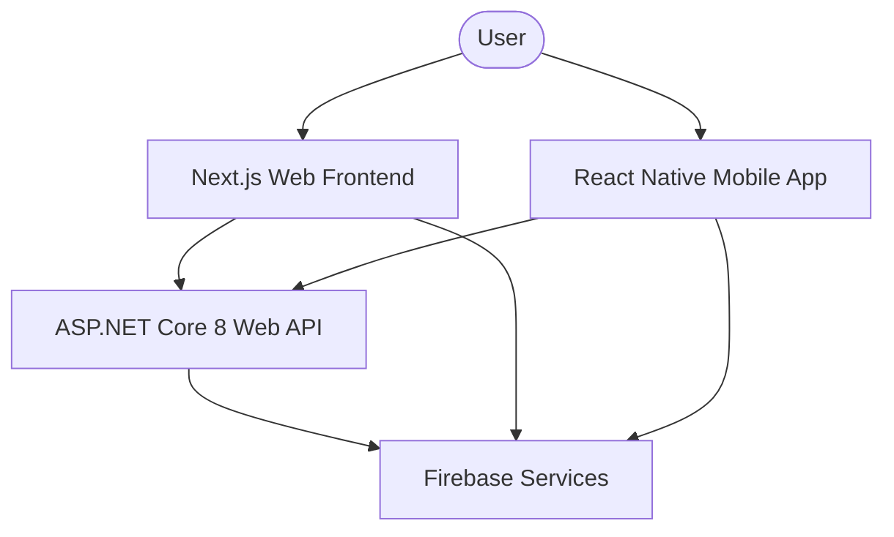

# VSTEP Writing Lab - Architecture Documentation

## Overview
The VSTEP Writing Lab is a full-stack platform designed to help students practice for VSTEP writing exams using AI-powered feedback.

## System Architecture

## Layers

### 1. Presentation Layer (VstepWritingLab.API)
- **Controllers**: Handle HTTP requests and return `ApiResponse<T>`.
- **DTOs**: Data Transfer Objects for input/output validation.
- **Middleware**: Exception handling, Logging, and JWT verification.

### 2. Business Layer (VstepWritingLab.Business)
- **Services**: Contain business logic, scoring algorithms, and data transformation.
- **Interfaces**: Define contracts for dependency injection.
- **Validators**: Fluent validation for requests.

### 3. Data Access Layer (VstepWritingLab.Data)
- **Repositories**: Abstract Firestore interactions.
- **Firebase**: Configuration and connection providers.
- **Entities**: Domain models representing Firestore documents.

### 4. Shared Layer (VstepWritingLab.Shared)
- **Models**: Common models used across all backend projects.
- **Constants**: Error codes, strings, and configuration keys.

## Integration
- **Auth**: Firebase Authentication (ID Tokens).
- **Database**: Google Cloud Firestore.
- **Storage**: Firebase Storage for essay-related assets if needed.
